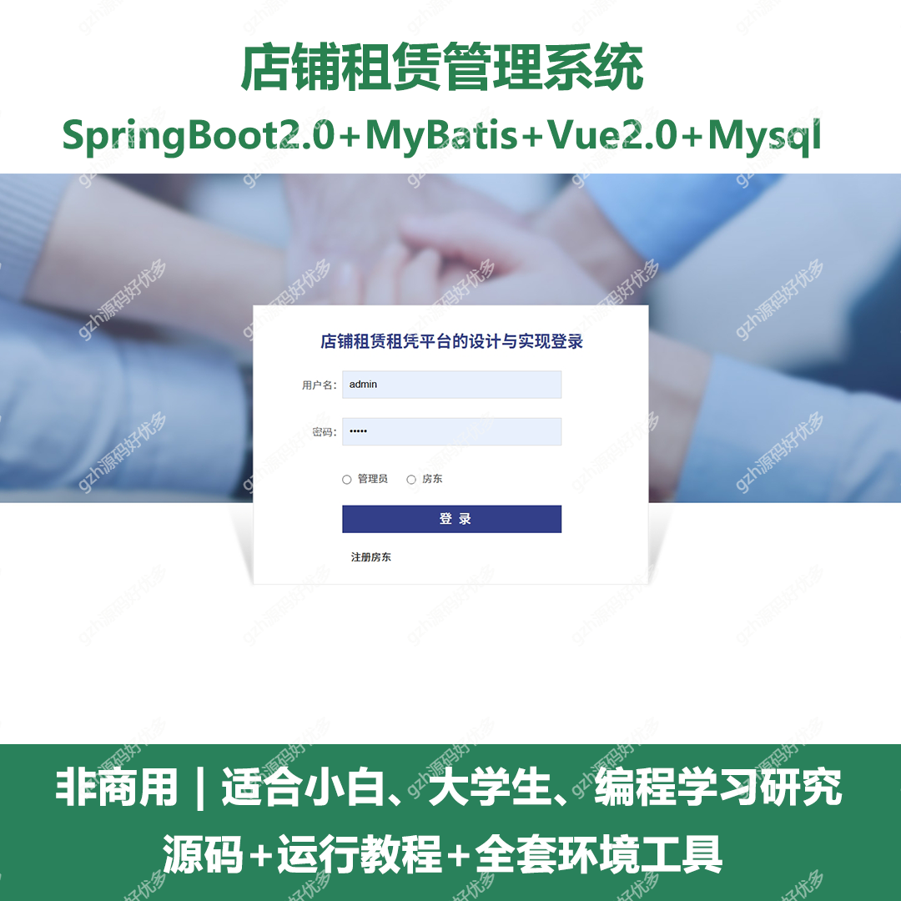
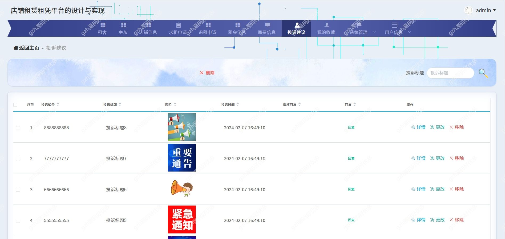
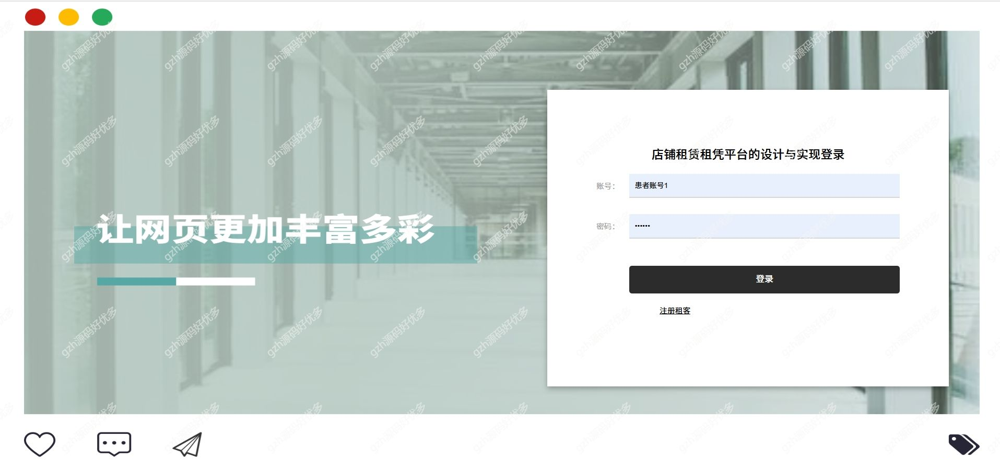
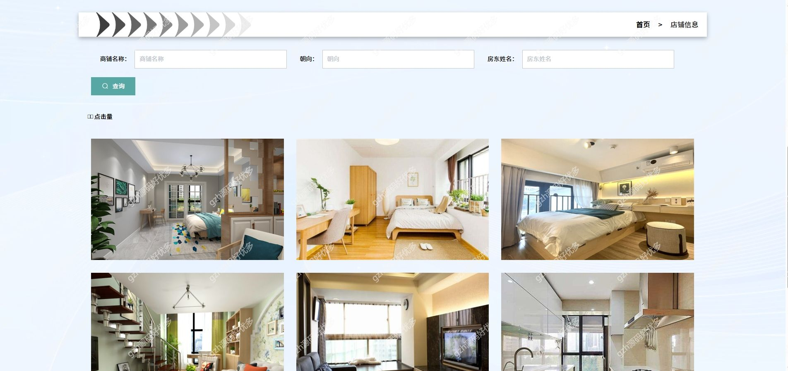
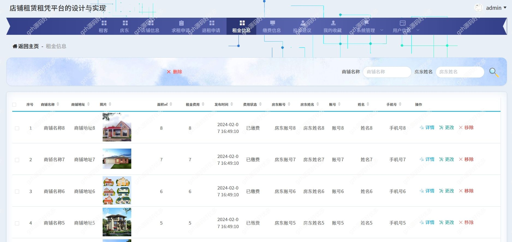
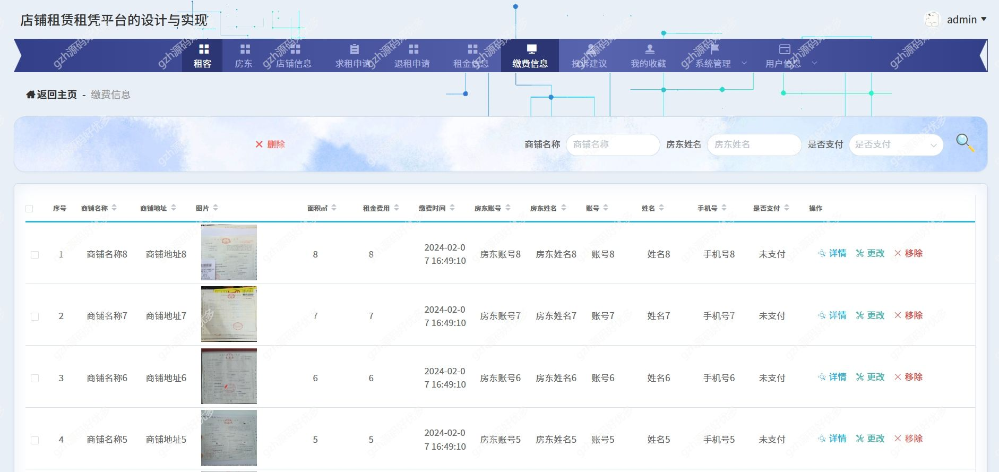
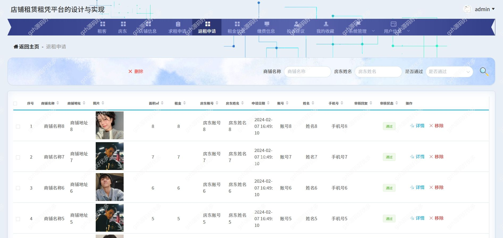

# springbootA330
springbootA330店铺租赁租凭平台
 
## 查看主页获取源码

### 一、关键词
店铺租赁租凭平台，店铺系统

### 二、作品包含
源码+数据库+全套环境和工具资源+本地部署教程

### 三、项目技术
前端技术：Html、Css、Js、Vue2.0、Element-ui 
后端技术：Java、SpringBoot2.0、MyBatis

### 四、运行环境（以下版本亲测，其他版本兼容性请自行测试）
开发工具：IDEA/eclipse  + VSCODE
数据库：MySQL5.7

数据库管理工具：Navicat10以上版本

环境配置软件： JDK1.8 + Maven3.6.3

前端Nodejs：14

浏览器：谷歌浏览器

### 五、项目介绍
项目编号：springbootA330

这个店铺租赁管理平台包含了多个功能模块，主要用于管理和处理与店铺租赁相关的信息。以下是各个主要模块和功能的详细介绍
租客、房东、店铺、租金及投诉建议管理于一体的综合性店铺租赁管理系统

### 六、运行截图

